# Domestic (UK) and International customer purchasing behavior
Data Sciences Institute - Cohort 7 - Team DS08 - Final Project

# Members
* Ayesha Hasan
* Bisharat Memon
* Jose Sosa

# Project Overview

* [Project Scope and Objectives](#project-scope-and-objectives)
* [Methodology](#methodology)
    * [Process](#process)
    * [Raw Data Inspection](#raw-data-inspection)
    * [Data Cleaning](#data-cleaning)
    * [Exploratory Data Analysis](#exploratory-data-analysis)
    * [Modeling: Clustering and Segmentation](#modeling-clustering-and-segmentation)
    * [Visualizations and Insights](#visualizations-and-insights)
    * [Conclusion and Recommendations](#conclusion-and-recommendations)
* [Team Videos](#team-videos)
* [Setup Instructions](#setup-instructions)

Raw data source: [UC Irvine Machine Learning Repository - Online Retail](https://archive.ics.uci.edu/dataset/352/online+retail)

Features of Interest: Quantity, InvoiceDate, UnitPrice, CustomerID, Country

# Project Scope and Objectives

This project focuses on analysing customer purchasing behaviour within an e-commerce context, with a particular emphasis on comparing domestic (UK) buyers and international buyers. By examining purchasing frequency, recency, and spending patterns, the aim is to group customers into meaningful behavioural segments that can support market-specific marketing strategies, customer retention initiatives, and broader commercial planning.

Using transactional data from December 2010 to December 2011, the project addresses several known data challenges, including missing CustomerID values, ambiguous cancellation records, and inconsistent item descriptions. Additional engineered variables, such as average days between purchases, recency in days, and total monetary value, create a richer foundation for behavioural analysis. These prepared features will then be used for unsupervised clustering through K-means, with the final number of clusters validated using elbow-based techniques.

The outcome of this work is a set of well-defined customer segments, accompanied by behavioural profiles and actionable recommendations. These insights are designed to support targeted campaigns, inform strategic decision-making, and optimise commercial resource allocation.

#### Business Case and Analytical Focus:

The central goal of the analysis is to understand how customer behaviour differs between the UK and international markets and how these differences translate into value for the business. While the UK constitutes the majority of transactions, international customers may demonstrate distinct, potentially high-value purchasing patterns that warrant tailored engagement. By revealing these behavioural differences, the project provides the organisation with evidence to support differentiated marketing strategies rather than a one-size-fits-all approach.

#### Business Question:

- How do domestic (UK) and international customers cluster based on purchasing frequency, purchasing recency, and spending patterns in order to identify high-value customer groups and design targeted marketing strategies?

This question anchors the analytical approach and ensures that the segmentation directly supports relevant commercial decisions.

#### Stakeholders:

- Business Development Team: Use customer clusters to identify priority markets, forecast sales by group, and plan partnerships and channel investments.
- Marketing and Customer Insights Team: Translate customer profiles into tailored offers, communication plans and engagement strategies, and track results to improve future campaigns.
- Data Science/Analytics Team: Maintain data pipeline, update segmentation when needed, and produce dashboards for decision support and ongoign monitoring.

#### Risks and uncertainties:

- Uncertainties:
    1. Having insufficient sample size, especially for international markets, may affect cluster representativeness.
    2. Ambiguity in cancellation reasons.
    3. Dataset spans December 2010 to December 2011, a single year, only therefore, external factors such as economic conditions, seasonality, and promotional cycles may impact generalizability for future years.
    4. Other factors not accounted for in dataset directly, such as delivery times, customer service experience, and online purchasing experience.

- Risks:
    1. Identified target segments may not be substantial in size or business impact.
    2. Insights may be biased due to missing or insufficient data.

# Methodology

### Process:

- Raw data Inspection: Audit schema and coverage, check date ranges, duplicates, cancellations, and country distribution to confirm data readiness.
- Data Cleaning: Prepare a single analysis-ready file, handle missing values, correct data types and standardize labels of interest; flag cancellations and adjustments, deduplicate and compute reliable totals.
- Exploratory Data Analysis: Summarize and compare the UK versus international mix, purchase frequency, recency, and spend, check for outliers and seasonality.
- Modeling: Clustering and Segmentation: Engineer frequency, recency, and spend features, scale data, run K-means, select k via elbow and silhouette method, and label segments.
- Visualizations and Insights: Create clear plots and summaries illustrating segment size, value, and behaviors by market for stakeholders.
- Conclusion and Recommendations: Synthesize segment findings into actionable recommendations for targeted marketing strategies and next steps, noting limitations and assumptions.

### Technical Stack:

#### Development Tools:

- VS Code
- Jupyter Notebooks
- Google Docs
- Google Colab
- Git & Github 

Programming Languages:

- Python

Libraries Used:

- Data Analysis and Visualization:
    1.  NumPy
    2.  Pandas
    3.  Matplotlib
    4.  Seaborn

- Clustering model, Evaluation and Validation:
    1.  scikit-learn

#### Collaboration Tools

- Slack
- Zoom
- Google Docs

## Raw data Inspection

The project begins with a controlled and reproducible process to fetch the original Online Retail dataset from the UC Irvine Machine Learning Repository. Instead of relying on manual downloads, the team uses a small, automated pipeline that ensures everyone works from the same trusted source.

The notebook loads configuration values from a .env file, including the remote data URL and the local raw data directory. A dedicated utility function then downloads the dataset as a ZIP file, stores it in the raw data folder, and extracts its contents for use in subsequent steps.

#### This approach delivers three main benefits:

- Consistency across the team: All collaborators access the exact same data from a single, versioned source.

- Reproducibility: The entire raw data acquisition process can be rerun at any time with a single command, supporting transparent and repeatable analysis.

- Clear data lineage: Separating raw data into a dedicated directory makes it easy to distinguish original files from any cleaned or transformed outputs used later in the project.

By formalizing the data fetch into code, the project establishes a stable foundation for the downstream cleaning, exploration, and clustering work.

## Data Cleaning

This stage transforms the raw Online Retail dataset into a reliable, analytics-ready table by addressing missing information, correcting structural inconsistencies, and standardizing key identifiers. The goal is to ensure that every transaction used in the segmentation model represents a valid, attributable customer purchase across clearly defined markets.

We began by importing the original Excel file and writing it to an intermediate CSV. Because CSV files do not preserve data types, the project uses an external source file that defines the expected schema for all key fields including invoice number, product code, description, quantity, unit price, customer ID, and country. This shared schema is referenced across all notebooks so that each dataset is read with consistent data types, supporting a fully reproducible and transparent pipeline.

A series of systematic checks were then performed to assess and improve data quality:

#### 1. Missing values and unusable records
The exploratory checks confirmed that missing values were concentrated in the Description and CustomerID fields, with the largest share originating from the United Kingdom. Since transactions without a customer ID cannot support customer-level analysis and transactions without a description lack product attribution, all rows missing either field were removed. This ensures that recency, frequency, and monetary calculations are based solely on complete and traceable customer activity.

#### 2. Duplicate transactions and invalid quantities or prices
The dataset contained more than five thousand fully duplicated rows, which were removed to avoid inflating purchase counts. Additional inspection revealed negative quantities and zero prices, typically associated with cancellations or administrative adjustments. These values were excluded to retain only revenue-generating purchases and avoid distortions in customer spending profiles.

#### 3. Data type corrections for analytical consistency
Using the shared schema definition, the InvoiceDate field was converted to a datetime format to enable accurate time-based feature engineering. Other categorical fields including invoice number, stock code, country, product description, and customer ID were standardized to string types so that grouping, filtering, and joins behave consistently across the analysis workflow.

#### 4. Standardizing country labels
Country names were cleaned to eliminate inconsistent spacing, unify text casing, and expand acronyms such as EIRE to Ireland, RSA to South Africa, and USA to United States. Non-geographic placeholders including "Unspecified" and "European Community" were removed to ensure that every transaction is linked to a clearly identifiable country.

Following these steps, the dataset was reduced from more than half a million records to approximately 392,000 high-quality, customer-attributable transactions. This curated dataset forms the foundation for the exploratory analysis and clustering that follows and ensures that the resulting customer segments are grounded in well-defined and reliable transactional behavior.

## Exploratory Data Analysis

The exploratory analysis focused on understanding customer behaviour across domestic and international markets while preparing the dataset for segmentation. After enforcing consistent data types using the project’s central schema file, several engineered features were introduced to support deeper behavioural insights.

Preparation steps included:

- Validating and converting data types according to the external schema definition
- Creating a transaction-level revenue field
- Flagging cancelled orders based on invoice patterns
- Classifying all customers into domestic or international segments
- Saving cleaned, structured and enriched data into the project’s organised data directories

Initial analysis revealed clear differences between markets. Domestic customers account for most transactions, while international customers place fewer orders but spend more per purchase. Weekly activity patterns show that:

- Domestic orders occur frequently and consistently
- International orders appear less often
- Revenue spikes from international customers tend to be larger due to higher-value baskets

This contrast is shown below.

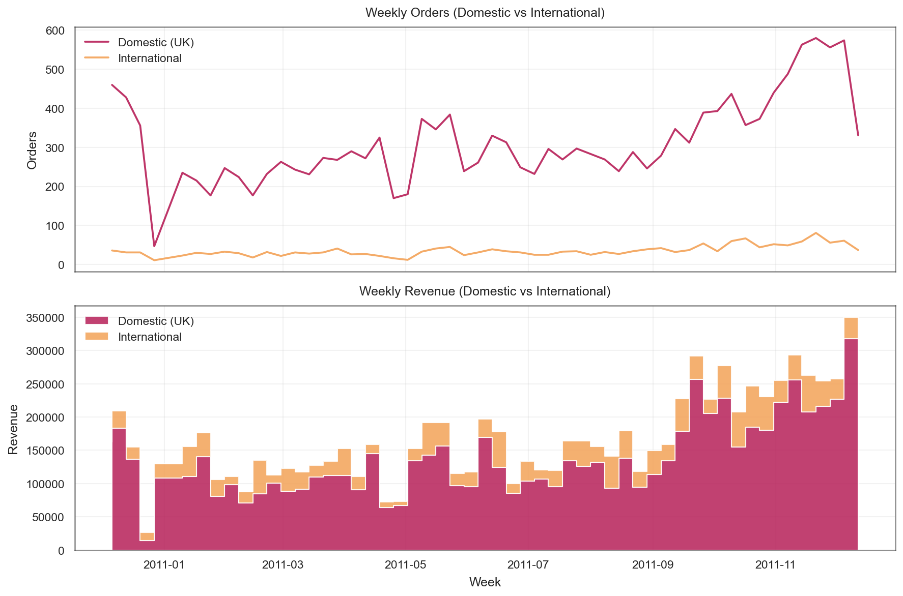

A wider commercial snapshot confirms the distinct dynamics of each customer base. Comparing total orders, total revenue and Average Order Value (AOV) across regions shows:

* Domestic customers:
    * Represent the majority of order volume
    * Generate most of the total revenue
    * Maintain lower average order values

* International customers:
    * Account for a smaller proportion of orders
    * Contribute a meaningful share of revenue despite lower volume
    * Exhibit significantly higher average order values

These differences are summarised in the following visualization.

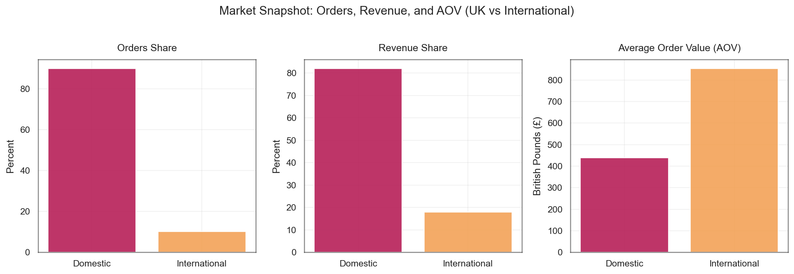

From the Monthly Average Order Value trends, a clear separation is observed for most of the year, with international customers consistently placing higher-value orders than domestic buyers. This pattern shifts at the end of the year. In December, the two markets converge, with the international AOV decreasing and the domestic AOV increasing, resulting in both groups showing similar order values for the first time in the annual cycle. This equalisation suggests a seasonal effect in which UK customers increase spending ahead of the holidays while international order values temporarily contract.

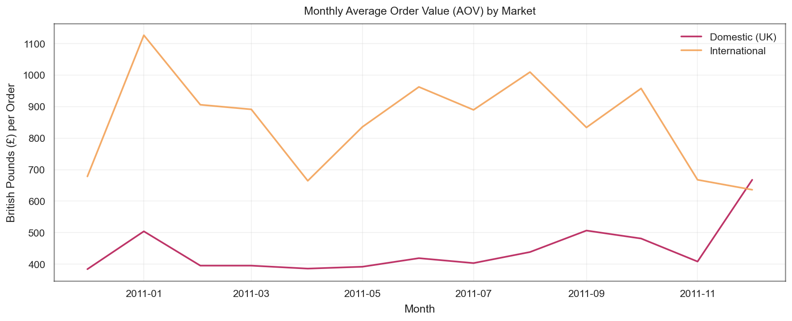

To support segmentation, Recency, Frequency and Monetary metrics were engineered at the customer level. These features capture core dimensions of purchasing behaviour:

- Recency measures days since the most recent purchase
- Frequency counts the number of unique transactions
- Monetary represents total customer spend

Final preparation work included:

- Merging the RFM metrics with customer attributes such as country and region
- Creating separate domestic and international datasets for modelling
- Exporting all RFM outputs to the prepared data folder for reproducibility

Overall, the exploratory analysis highlights two structurally different customer groups. Domestic customers form a high-volume, stable purchasing base, while international customers contribute less frequently but with higher-value orders. These insights, together with the engineered RFM dataset, establish a strong analytical foundation for the subsequent clustering and segmentation stage.

## Modeling: Clustering and Segmentation

#### Modeling: Clustering and Segmentation

Building on a single unified RFM dataset derived from all customers, this stage applies K-Means clustering separately to Domestic (UK) and International (non-UK) customer subsets. Both subsets originate from the same RFM table; they are split only at the modeling stage to allow market-specific segmentation. The goal is to uncover behaviourally distinct customer segments in each market, and to compare how these segments differ in size, value and engagement.

Once the unified RFM table is split into Domestic and International subsets, the modeling steps applied to each subset are the same:

* Use customer-level RFM features
    * Recency: days since the most recent purchase
    * Frequency: number of unique purchase occasions
    * Monetary: cumulative spend in British pounds

* Apply a log transformation to reduce skewness in RFM features
* Standardize the transformed features so they share a common scale
* Fit K-Means models across multiple values of k
* Select an appropriate number of clusters using inertia and silhouette diagnostics
* Train a final K-Means model with the chosen k and assign each customer to a cluster
* Translate clusters into business-friendly segments using RFM profiles

#### Feature Transformation and Scaling

Within the unified RFM dataset, and consequently within both the Domestic and International subsets derived from it, the raw distributions are highly skewed. Most customers purchase infrequently and spend relatively little, while a small minority account for very high Monetary values. To avoid letting extreme spenders dominate the clustering, the following transformations are applied in each notebook:

* Log-transform Recency, Frequency and Monetary using a natural log of (x + 1)
* Standardize the transformed features so that each has approximately mean zero and unit variance
* Inspect correlations to confirm that Frequency and Monetary move together and that Recency is negatively related to both

Below are the RFM distributions for the Domestic and International subsets after applying the same transformation and scaling steps derived from the unified RFM dataset.

###### Domestic: 
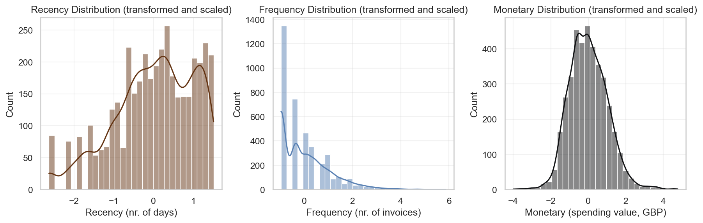

###### International:
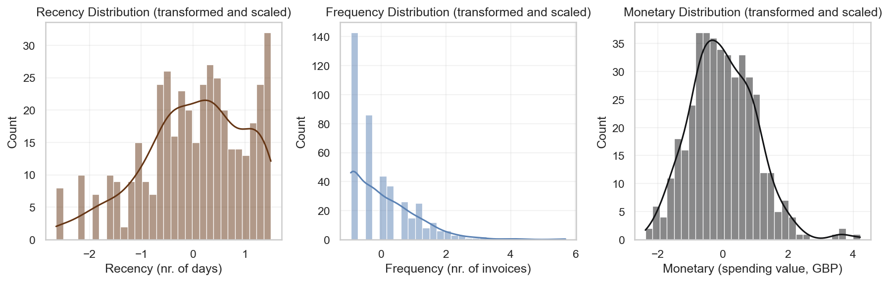

#### Selecting the Number of Clusters

Since the number of segments is not known in advance, K-Means is run with k from 2 to 10 for both markets. Two diagnostics are used:

* An Elbow curve of inertia (within-cluster sum of squares) to show how compactness improves as k increases
* A Silhouette score curve to measure how well each customer fits within its assigned cluster

For both Domestic and International subsets of the unified RFM dataset, the Elbow and Silhouette plots support a four-cluster solution as a good balance between interpretability and separation quality.

###### Domestic:
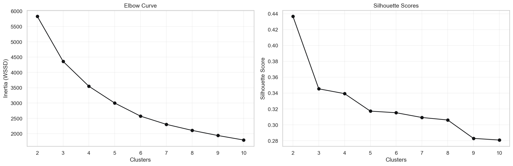

###### International:

#### Final K-Means Models and Cluster Assignment

Using k equal to four for each market, final K-Means models are trained on the transformed and scaled RFM features.

* The Domestic model clusters approximately 3,900 UK customers (filtered from the unified RFM dataset) into four groups.
* The International model clusters approximately 400 non-UK customers (from the same unified RFM dataset) into four groups.

Cluster labels are assigned to each customer and saved into prepared CSV files for further analysis and reporting:

* data/prepared/rfm_domestic_clustered_segmented_final_k_4.csv
* data/prepared/rfm_global_clustered_segmented_final_k_4.csv

This provides a consistent basis for comparing segment behaviour across markets. Because both market subsets originate from the same RFM source table and are processed using the same transformation pipeline, their segments remain structurally comparable.

#### Segment Profiles: Domestic vs International

For each market, clusters are profiled using average Recency, Frequency, Monetary and segment size. These statistics are then mapped to intuitive business segments. In both markets, four comparable segments emerge:

* VIP / Champions
    * Very recent purchasers
    * High purchase frequency
    * Highest spending levels per customer

* Loyal Customers
    * Regular purchasing behaviour
    * Moderate to high spending
    * Important for consistent revenue

* Potential Loyalists
    * Relatively recent purchases
    * Lower frequency and spend so far
    * Opportunity to nurture into higher-value segments

* At-Risk Customers
    * Long time since last purchase
    * Low frequency and low spend
    * At risk of churn or already disengaged

* In the Domestic market:
    * At-Risk customers represent the largest segment by count.
    * VIP / Champions and Loyal Customers together capture a substantial share of total spend.
    * Potential Loyalists are a meaningful group of customers who have purchased recently but have not yet reached high frequency or monetary levels.

* In the International market:
    * VIP / Champions show especially high Monetary values, often exceeding their domestic counterparts on a per-customer basis.
    * Loyal Customers and Potential Loyalists are smaller in absolute size but strong in revenue contribution relative to their counts.
    * At-Risk customers, while fewer than in the domestic base, still indicate churn risk in international markets that may require targeted re-engagement.

###### Domestic:
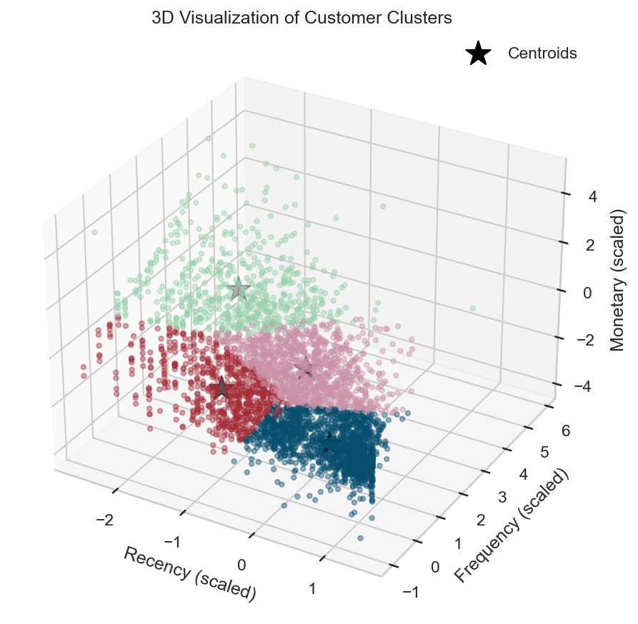 

###### International:
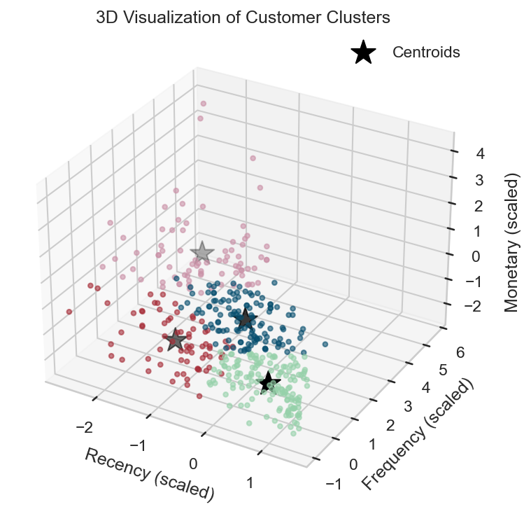

#### Visualizing Clusters

To validate that the clusters are distinct and interpretable, dimensionality reduction and distribution plots are used to visualize the segment structure separately for each market.

First, Principal Component Analysis (PCA) projects the three RFM dimensions into two components. Each point represents a customer and is coloured by segment label.

* In both markets, VIP / Champions and At-Risk customers tend to occupy opposite ends of the PCA space.
* Loyal Customers and Potential Loyalists cluster between these extremes, reflecting intermediate levels of value and engagement.

###### Domestic:
 

###### International:
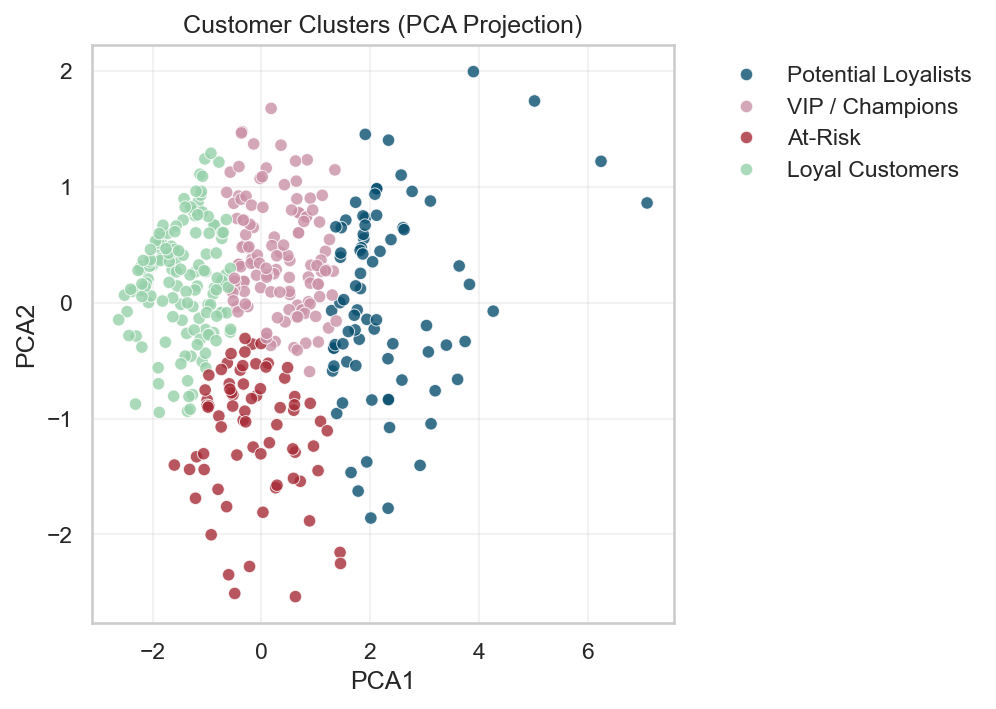

Next, boxplots of Recency, Frequency and Monetary by segment provide a more detailed look at how behaviour differs within each market.

* VIP and Loyal segments cluster around low Recency, higher Frequency and higher Monetary values.
* Potential Loyalists show relatively recent activity but lower Frequency and spend.
* At-Risk customers have high Recency and very low Frequency and Monetary values.

###### Domestic:
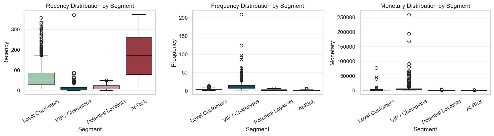 

###### International:
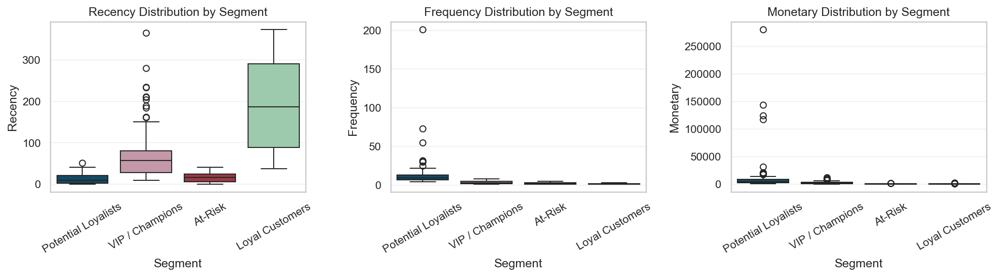

## Insights and Recommendations

This section synthesises the commercial insights emerging from the segmented RFM dataset and the subsequent revenue and elasticity analyses. It highlights how value is distributed across customer segments in both Domestic (UK) and International markets, where the strongest opportunities for growth lie, and what strategic actions can support improved commercial performance.

### Domestic (UK) Market Insights:

The UK market is characterised by high purchase frequency but comparatively lower basket values. Revenue is concentrated among a relatively small share of customers, revealing a clear opportunity to reinforce loyalty and prevent churn.

Key Insights:

* Revenue concentration:
    * A small subset of customers generates a disproportionately large share of revenue, reflecting a classic Pareto pattern.
* Customer behaviour:
    * High transaction frequency
    * Lower average spend per order
    * Strong potential for uplift through targeted retention programmes

* Potential Loyalists as a growth lever:
    * This segment represents a large share of the customer base and shows strong potential to move into higher-value behaviour with the right incentives.

#### Domestic Revenue Uplift Scenarios:

A conversion analysis quantifies how revenue would increase if Potential Loyalists shifted their behaviour to resemble Loyal Customers.

###### Domestic Incremental Revenue Uplift (GBP):

###### Domestic Revenue Uplift as % of Total Revenue:

Examples:

* Converting 100% of Potential Loyalists would increase revenue by £1.12M, representing a 69% uplift.
* Even a 25% conversion yields over £280k, or a 17% uplift in total revenue.

#### Recommended Actions (Domestic):

* Strengthen loyalty programmes to encourage repeat purchases and maintain engagement.
* Develop VIP perks, including:
    * Exclusive access
    * Early product previews
    * Personalised recommendations
    * Free shipping tiers
* Activate Potential Loyalists through:
    * Personalised “we miss you” messages
    * Time-limited reactivation incentives
    * Offers linked to previously browsed or purchased categories

### International Market Insights:

International customers represent a smaller but highly valuable user base. Their spending levels are significantly higher, and revenue is heavily concentrated among top segments. The strongest commercial lever in these markets is increasing purchase frequency.

Key Insights: 

* High-value VIP presence: VIP customers contribute over 70% of total international revenue and spend twice as much on average as UK VIPs.
* Frequency drives revenue: A strong Monetary–Frequency correlation indicates that each additional purchase yields meaningful revenue gains.
* Market variability: Elasticity analysis reveals clear differences across countries in how spending responds to additional purchases.

###### International Market - Top 10 Countries by Elasticity:

Country-Level Elasticity Patterns: 

* Highly responsive markets (e.g., France, Finland, Portugal, Germany):
    * Spending grows more than proportionally with each additional purchase.
    * Extra transactions can generate £700–£850 in incremental revenue per customer.
* Moderately responsive markets:
    * Still receptive to engagement, but with more stable spending patterns.
* Lower-responsiveness markets:
    * Better suited to increasing value per transaction rather than frequency.

#### Recommended Actions (International)

* High-responsiveness markets:
    * Reorder incentives and frequency-based rewards
    * Auto-replenishment reminders
    * Loyalty credit for consecutive monthly purchases
* Moderate-responsiveness markets:
    * Calibrated promotions tied to elasticity
    * Upsell and cross-sell campaigns
* Lower-responsiveness markets:
    * Improve AOV through:
        * Premium bundles
        * Tiered shipping upgrades
        * Value-add accessories

#### Strategic Takeaways Across Markets

* Domestic: Prioritise loyalty and retention, particularly converting Potential Loyalists and strengthening the VIP experience.

* International: Focus on increasing purchase frequency in responsive markets and raising average order value where frequency gains are limited.

* Combined global approach: A balanced strategy that reinforces loyalty at home while stimulating high-impact frequency abroad offers the strongest overall return.

# Team Videos

* Ayesha Hasan |
* Bisharat Memon |
* Jose Sosa |

# Setup Instructions
1. Clone this repository (If this is a fork, use your fork's URL below).

    `git clone https://github.com/bisharatm/ds08_online-retail.git`

2. Change to the project directory

    `cd ds08_online-retail`

3. Install dependencies

    **Note:** Create and activate a **seperate** virtual environment for the project.

    `pip install -r requirements.txt`

4. Launch Jupyter Notebook (dashboard opens in browser)

    `jupyter notebook`

5. Run notebooks

    Navigate to each notebook (numbered sequentially), open and run individually, making sure to run them in the intended order. Various outputs, such as, interim and final datasets, and visualizations will be exported and saved into approprirate folders under `data/` or `reports/`.
